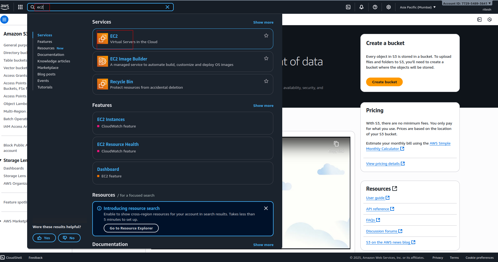
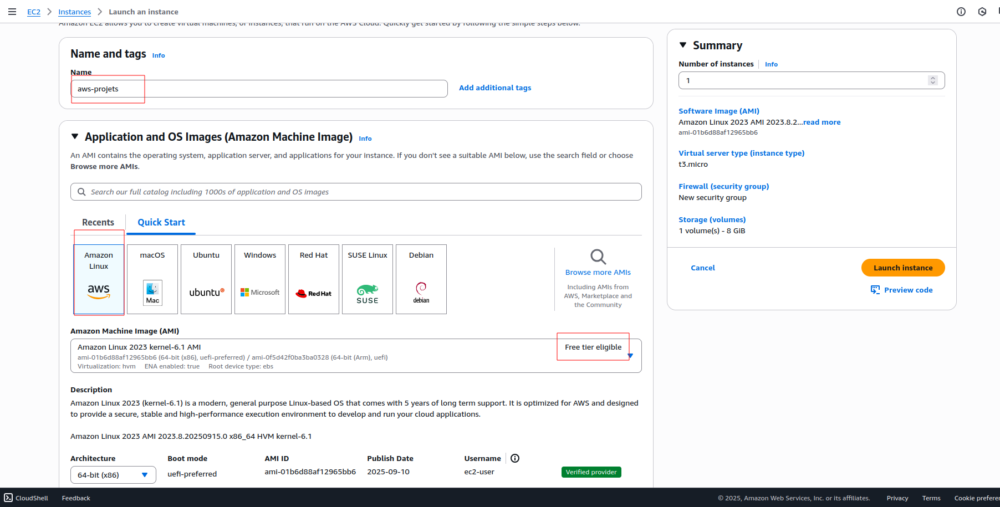
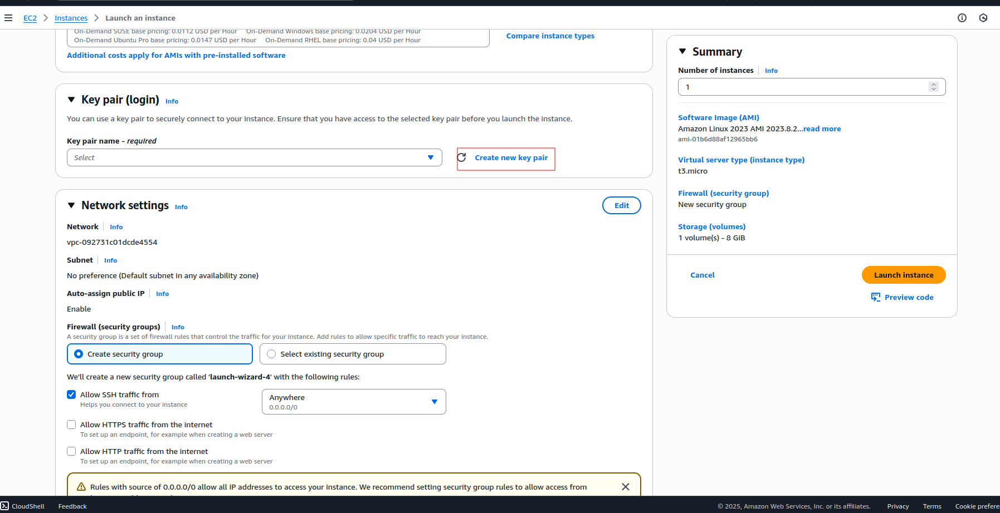
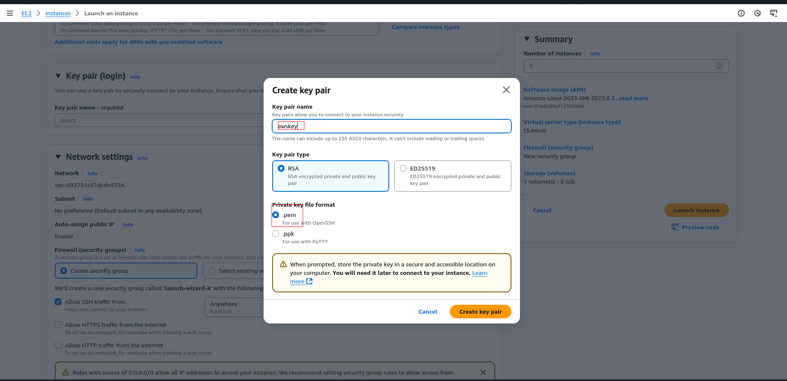
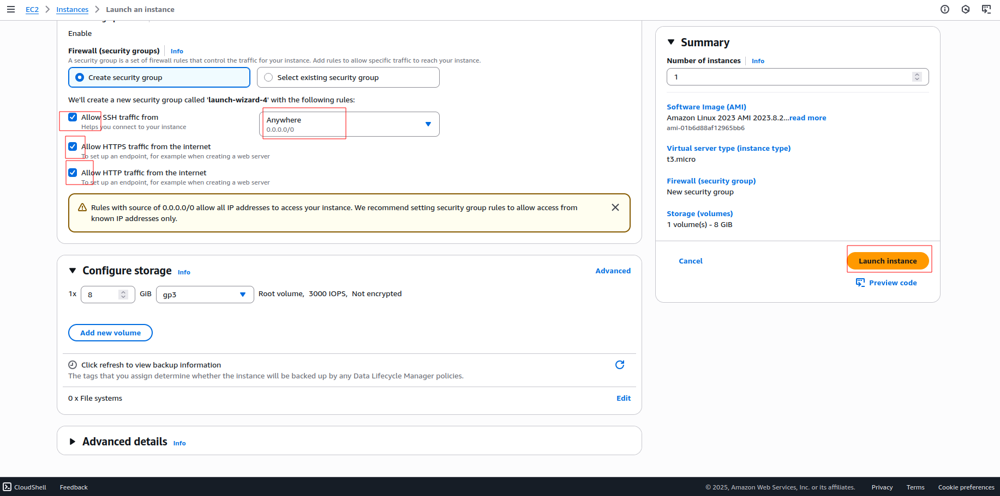

# Project 1: Launch an EC2 Instance

## 🎯 Objective
Learn how to launch, configure, and connect to an Amazon EC2 instance.  
This project will give you hands-on experience with AWS compute services and basic networking.

---

## 🛠️ AWS Services Used
- **EC2 (Elastic Compute Cloud):** Virtual server hosting
- **IAM:** Secure access with least privilege
- **Security Groups:** Firewall rules
- **Key Pairs:** Secure SSH login

---

## 📋 Steps

---

### 1. Launch an EC2 Instance
1. Go to **EC2 Console .

---
2.  **write the name of server**.
   
---
3. Choose **Amazon Linux 2 AMI (Free Tier Eligible)**.
4.  4. Select instance type: **t2.micro** (Free Tier).

      
---
   
5. Create a new **Key Pair** →
         
---
6. write the **key pair** name according to you
            

8. Configure **Security Group**:
   - Allow **SSH (22)** from My IP
   - (Optional) Allow **HTTP (80)** for web access
         

     
9. Launch instance.

---

### 3. Connect to Instance
1. Open terminal and set correct permissions for key:
   ```bash
   chmod 400 mykey.pem

