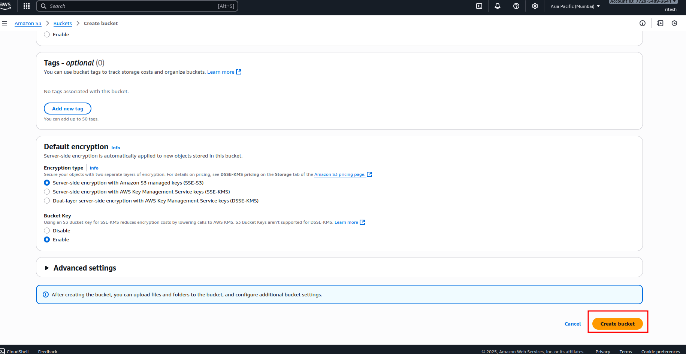

# Project 2: Create S3 Bucket

## 🎯 Objective
Learn how to create, configure, and use an Amazon S3 bucket for storage.  

---

## 🛠️ AWS Services Used
- **S3 (Simple Storage Service):** Object storage
- **IAM:** User access and permissions
- **Bucket Policies:** Control access

---

## 📋 Steps

### 1. Go to **AWS Console → S3**.

 
4. Disable **Block all public access** if you want public website access (for testing).  
5. Click **Create Bucket**.

---

### 2. Click on create button.  

---
### 3.Provide a **unique bucket name** (e.g., `ritesh355`).

---

### 3.Scroll down add click on create button (make everything is default )

### 4. your bucket is created 

