# Project 3: Simple Static Website Hosting on S3

## 🎯 Objective
Host a static HTML website using **Amazon S3**.  
This project helps you learn how to create a public bucket, upload files, enable static website hosting, and apply a bucket policy.

---

## 🛠️ AWS Services Used
- **S3 (Simple Storage Service):** Object storage for website files  
- **Bucket Policy:** Make objects publicly accessible  

---

## 📋 Steps with Screenshots

### 1. Create an S3 Bucket
1. Go to **AWS Console → S3**
2. Give a **unique bucket name** (e.g., `my-static-website`). in my case when i use this name it is allready that why i change this with ritess355
  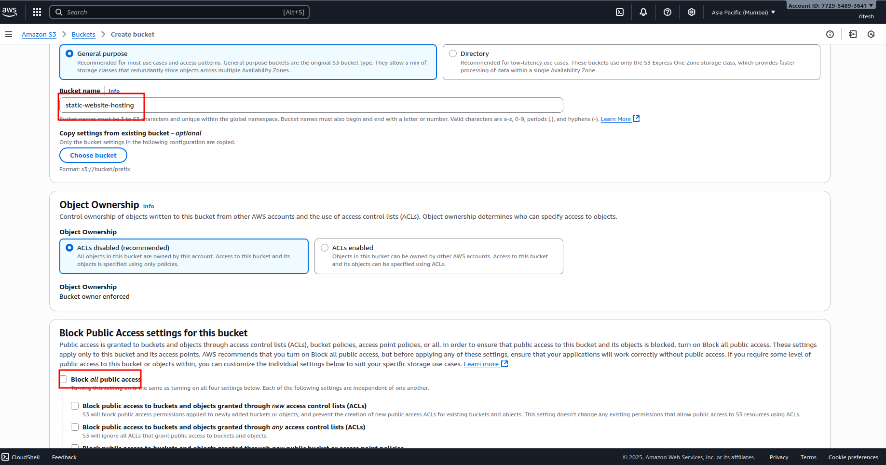

---

4. Uncheck **Block all public access**.  
  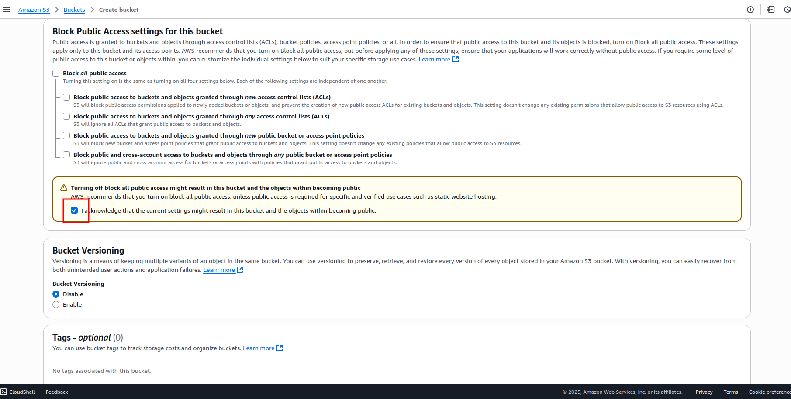

---

6.  Click **Create Bucket**.
   after clicking bucket is created like this
  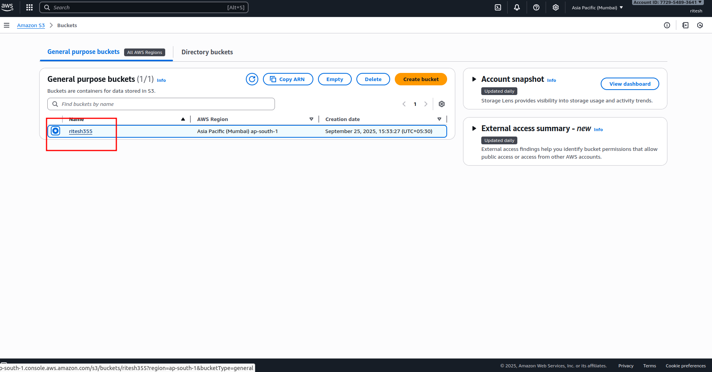

---

### 2. Upload Website Files
1. Open your bucket → **Upload**.  

**Screenshot: File Upload**  
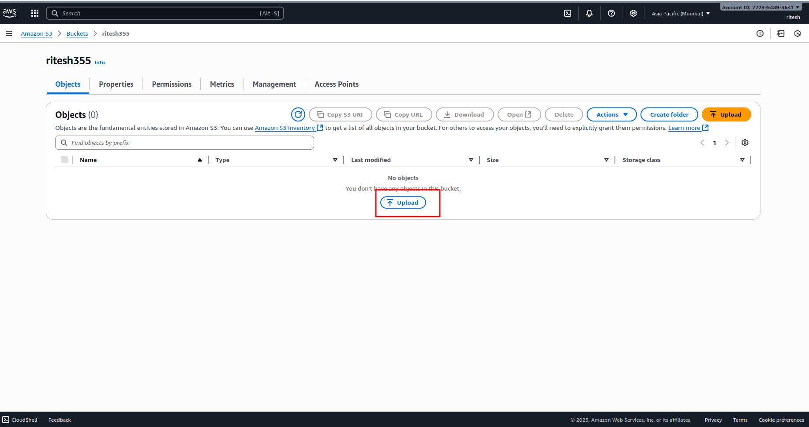

---

2. Upload `index.html` and other website files (CSS, JS, images).  
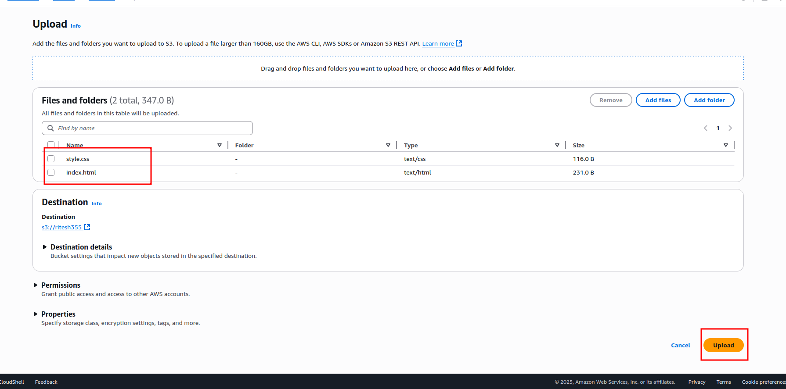


---

### 3. Enable Static Website Hosting
1. Go to **Properties → Static website hosting → Edit**.
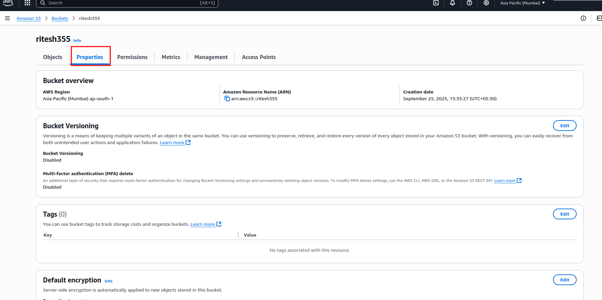

**scroll down**
   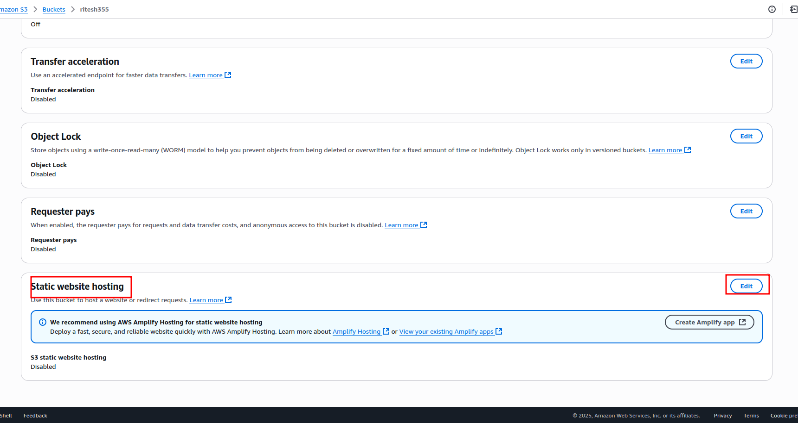

2. Select **Enable**.  
3. Enter **Index document**: `index.html`  
4. (Optional) **Error document**: `error.html`
 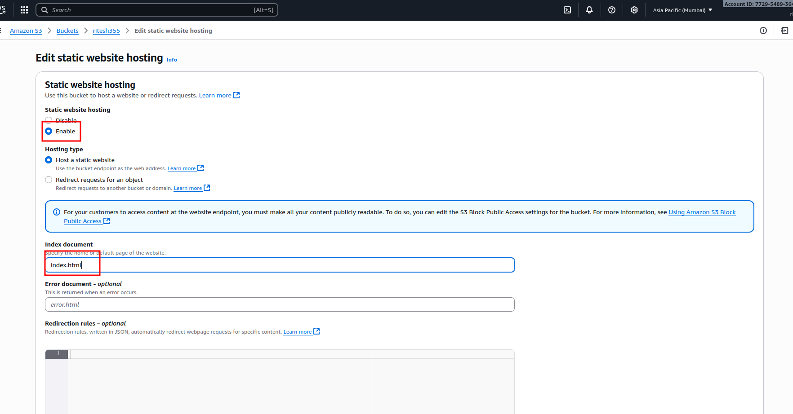

6. Save changes.  

---

### 4. Add Bucket Policy (Make Website Public)
1. Go to **Permissions → Bucket Policy**.  
2. Paste the following policy, replacing `YOUR-BUCKET-NAME`:

```json
{
  "Version": "2012-10-17",
  "Statement": [
    {
      "Sid": "PublicReadGetObject",
      "Effect": "Allow",
      "Principal": "*",
      "Action": "s3:GetObject",
      "Resource": "arn:aws:s3:::YOUR-BUCKET-NAME/*"
    }
  ]
}
```
---

 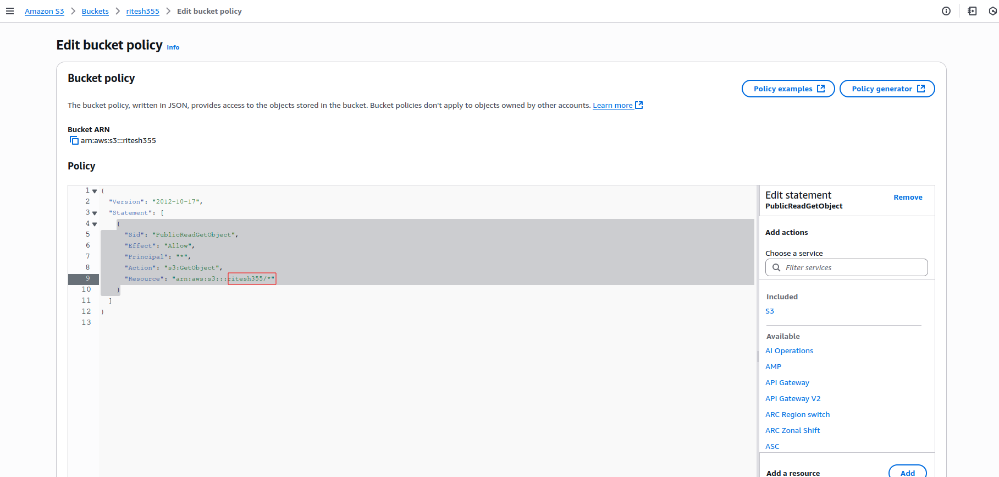


## Access Your Website

 Go to Properties → Static website hosting → Bucket website endpoint.

 Open the URL in a browser:
 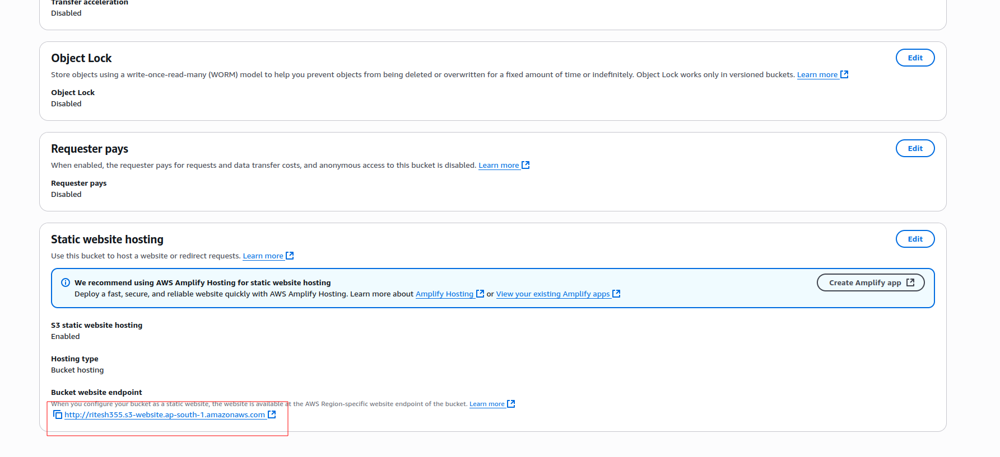

---
## copy that link and paste your browser 

 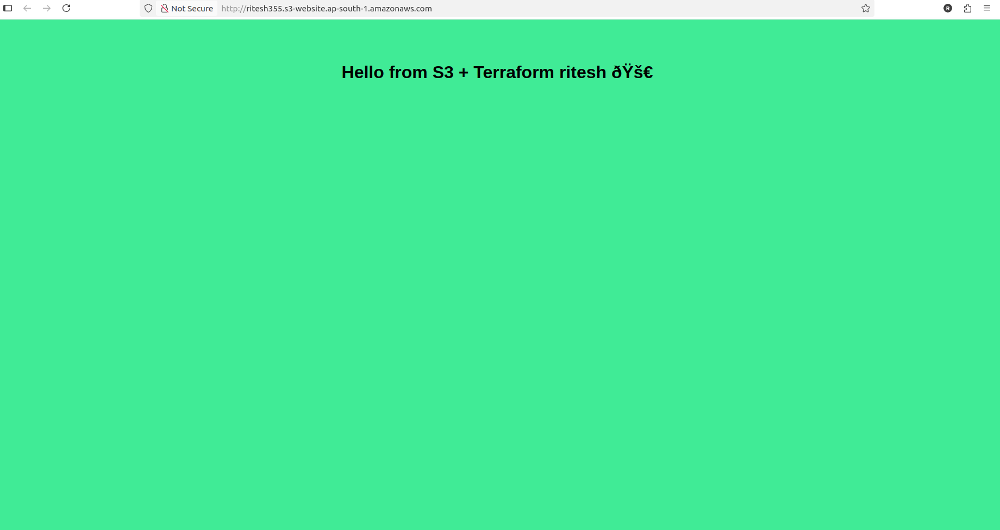

 ## ✅ AUTHOR

 


