## AWS LAB — Application Load Balancer (ALB)
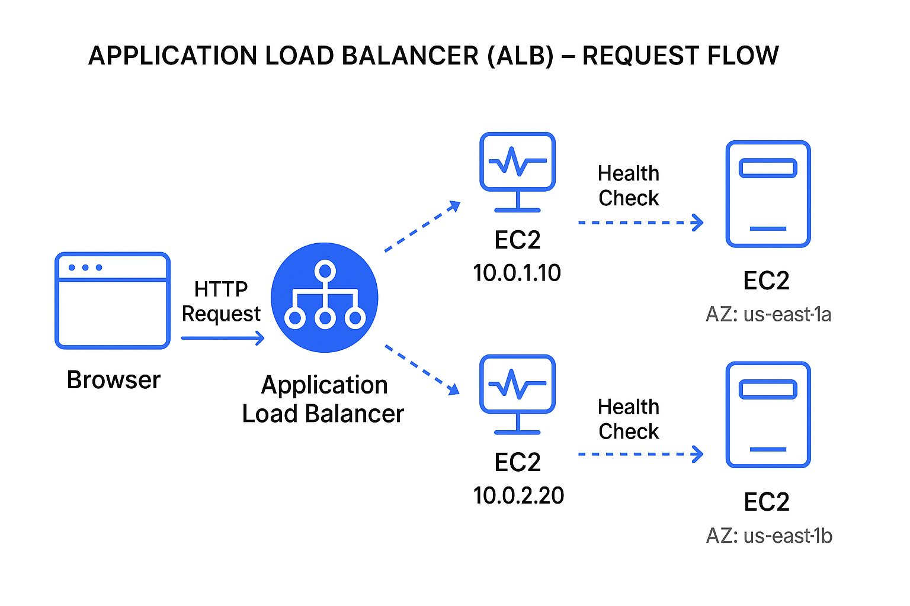

## 🎯 Goal
 Deploy a highly available web app using:

 - 2 EC2 instances (in different Availability Zones)

 - 1 Application Load Balancer (ALB)

 - 1 Target Group to route traffic evenly

 Verify Cross-Zone Load Balancing and Health Checks
 
 
## 🧩 Architecture Diagram

## 🪜 Step-by-Step Guide
### Step 1️⃣ – Launch 2 EC2 Instances
1. Go to EC2 Console → Launch Instances
   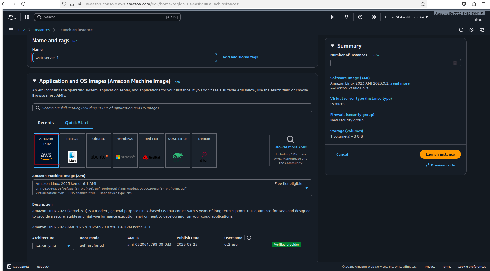

3. Name them:
  - web-server-1

  - web-server-2

3. Choose:
  - Amazon Linux 2 AMI

  - Instance type: t3.micro

4. Network:

  - VPC: default

  - **Subnets**:
  - web-server-1 → subnet in us-east-1a
  -   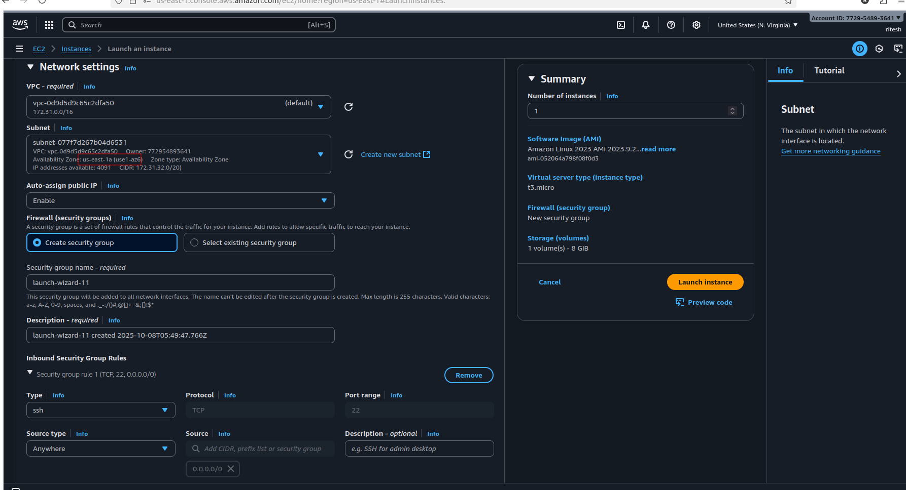

  - web-server-2 → subnet in us-east-1b  
5. Enable Auto-assign Public IP

6. Create or select a Security Group:

 - Allow:

  - HTTP (port 80)

  - SSH (port 22)
  - 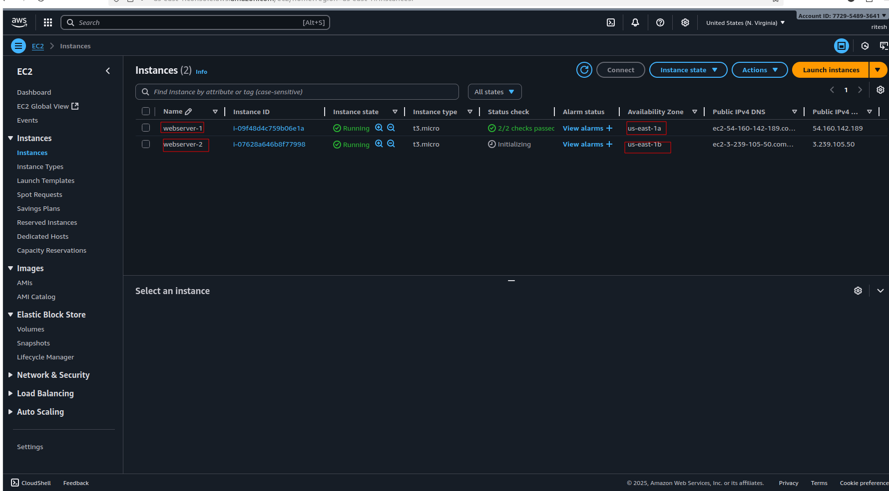

7. Launch with an existing key pair.
  
### Step 2️⃣ – Launch 2 EC2 Instances
SSH into both instances: 
  - 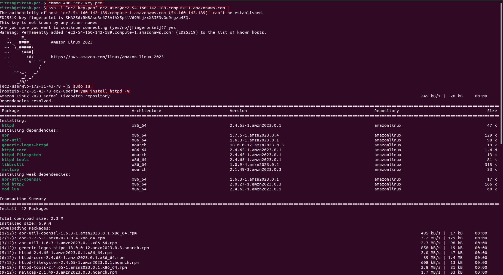

**For web-server-1:**
```
sudo su
yum install httpd -y
echo "<h1>Welcome to Web Server 1 - $(hostname)</h1>" > /var/www/html/index.html
systemctl start httpd
systemctl enable httpd
```
  - 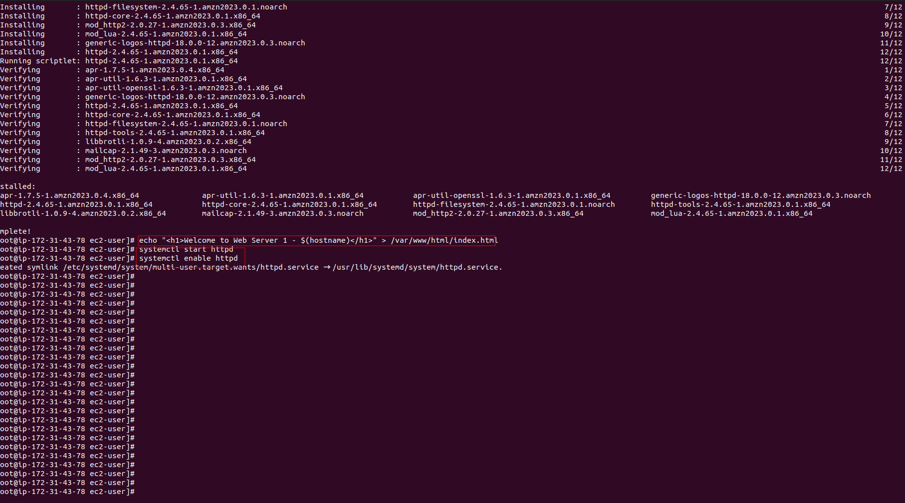

**For web-server-2:**
```
sudo su
yum install httpd -y
echo "<h1>Welcome to Web Server 2 - $(hostname)</h1>" > /var/www/html/index.html
systemctl start httpd
systemctl enable httpd
```
✅ Check each instance in browser:

```
http://<public-ip-of-web-server-1>
http://<public-ip-of-web-server-2>
```
You should see:
  - 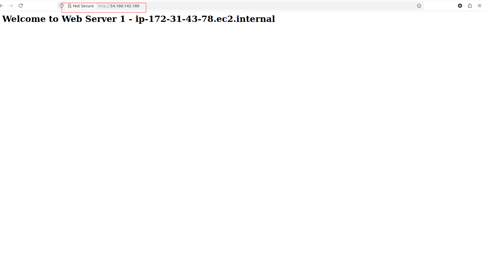
  -   - 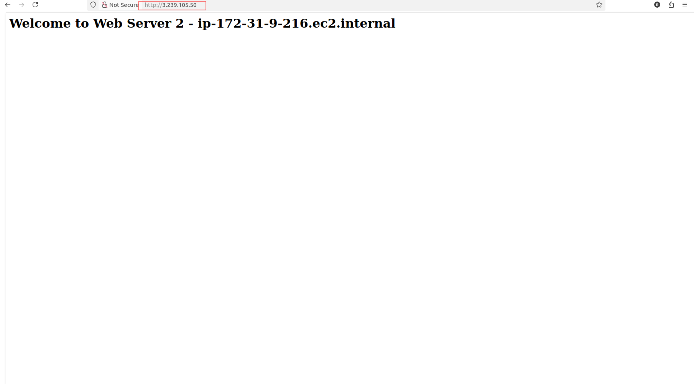


“Welcome to Web Server 1” and “Welcome to Web Server 2”

### Step3️⃣  – Launch 2 EC2 Instances
1. Go to EC2 → Target Groups → Create Target Group
  -   - 

2. Choose:

  - Target Type: Instances

  - Protocol: HTTP

  - Port: 80

3. Give it a name: web-target-group
  -   - 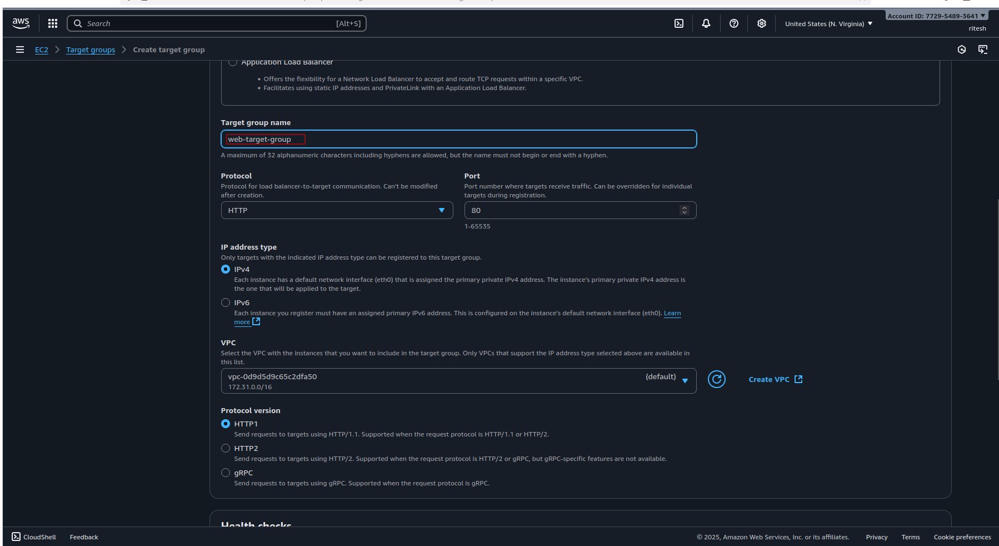

4. VPC: default

5. Health checks:

   - Protocol: HTTP

   - Path: /

6. Click Next

7. Register both EC2 instances (web-server-1 and web-server-2)
  - 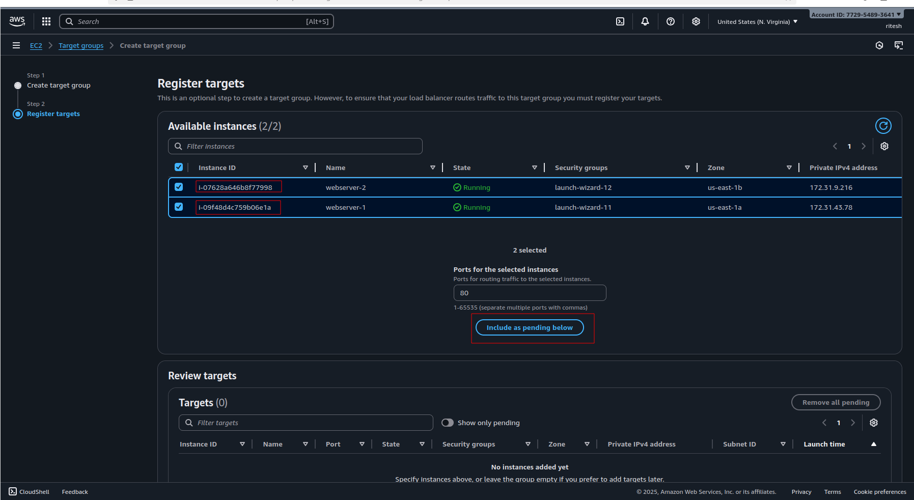

8. Click Create Target Group
  - 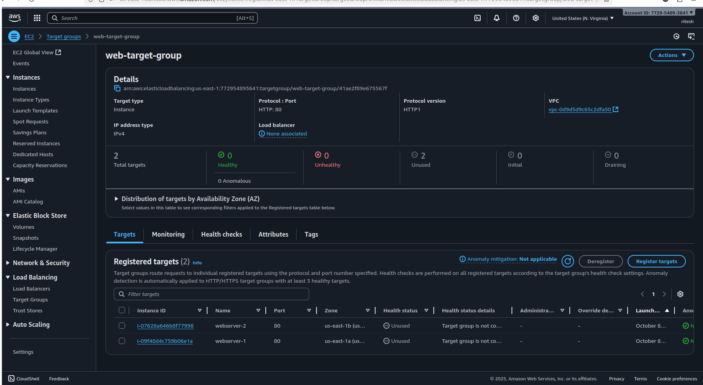

---
###Step 4️⃣ – Create Application Load Balancer (ALB)
1. Go to EC2 → Load Balancers → Create Load Balancer
  - 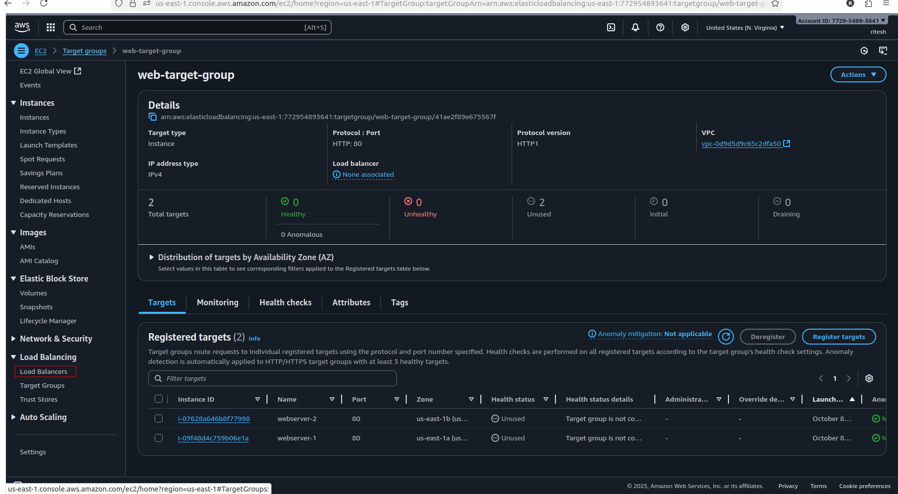

2. Choose Application Load Balancer
  - 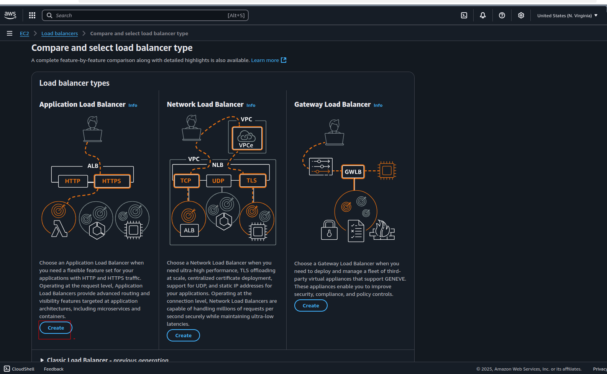

3. Name: my-app-load-balancer
4. Scheme: Internet-facing

5. IP Type: IPv4

6. Network Mapping:

  - Select your VPC

  - Choose 2 subnets (in different AZs)

7. Security Group:

  - Allow inbound HTTP (port 80)

7. Listener:

  - Protocol: HTTP

  - Port: 80

  - Default Action: Forward to web-target-group
  - 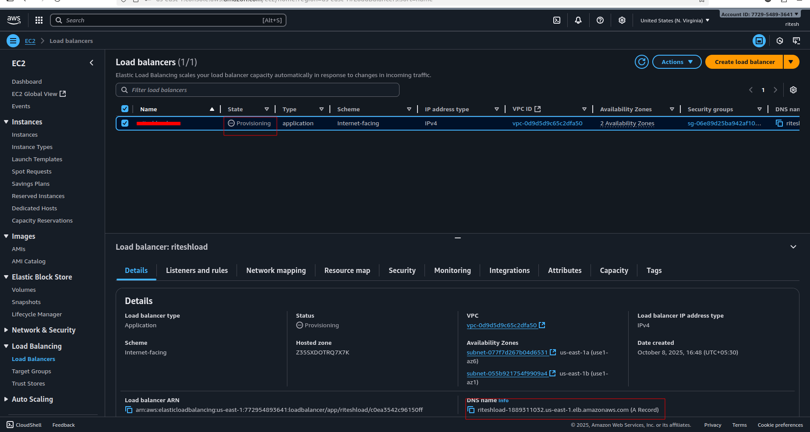

8. Click Create Load Balancer

---

## Step 5️⃣ – Verify Everything

1. Go to the ALB’s Description tab

2. Copy the DNS name (looks like my-app-load-balancer-123456789.elb.amazonaws.com)

3. Open in browser:
```
http://my-app-load-balancer-123456789.elb.amazonaws.com
```
  - 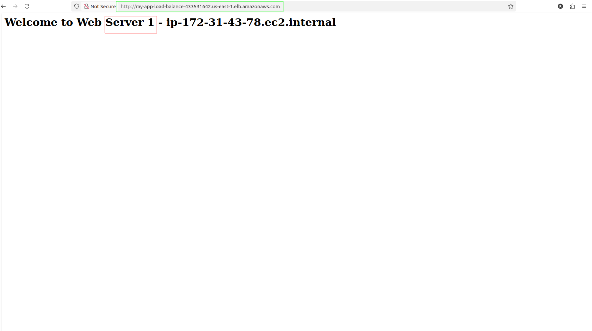
  - 
  - 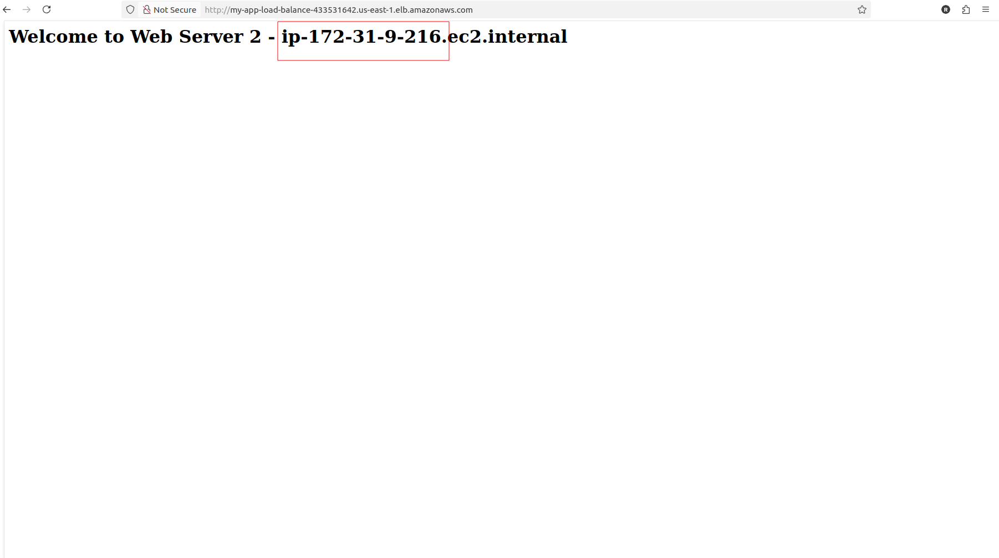


🔁 Refresh multiple times —
You should see responses alternating between:

“Web Server 1” and “Web Server 2”

🎉 That means your ALB is successfully load balancing traffic

---
### Step 6️⃣ – Check Cross-Zone Load Balancing

1. Go to your ALB → Attributes tab

2. Ensure “Cross-Zone Load Balancing” is Enabled

3. You can toggle it if needed.

This ensures requests are distributed across all healthy instances in all AZs.

---
### Step 7️⃣ – Test Health Checks

1. Stop the web-server-2

2. Watch your Target Group → Targets tab

3. You’ll see web-server-2 turn Unhealthy

4. Refresh ALB DNS in your browser → only Web Server 1 responds!

✅ You’ve confirmed health check and failover behavior.


---
## THANK YOU 
