# AWS RDS Lab: Create and Connect to MySQL Database

## 🎯 Lab Goal
You’ll create and connect to an **Amazon RDS instance** (MySQL engine) and learn key configuration settings, networking, and basic SQL operations.

---

## 🧩 Prerequisites
- AWS account with console access
- One EC2 instance (Ubuntu or Amazon Linux) to connect to the database
- Basic VPC setup (default VPC is fine)

---

## 🧪 Step 1: Open RDS Service
1. Sign in to the **AWS Management Console**.  
2. Search for **RDS** and open it.
  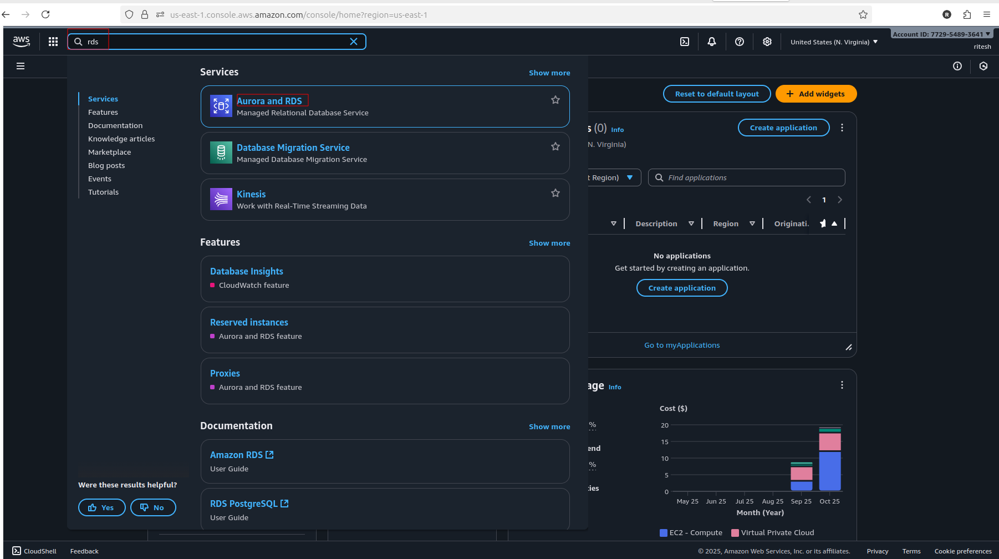
4. Click **Create database**.
   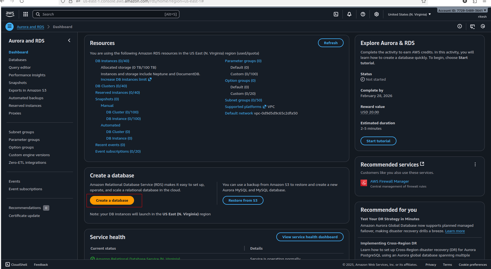

---

## 🧱 Step 2: Choose Database Creation Method
- **Method:** Standard create  
- **Engine type:** MySQL
- 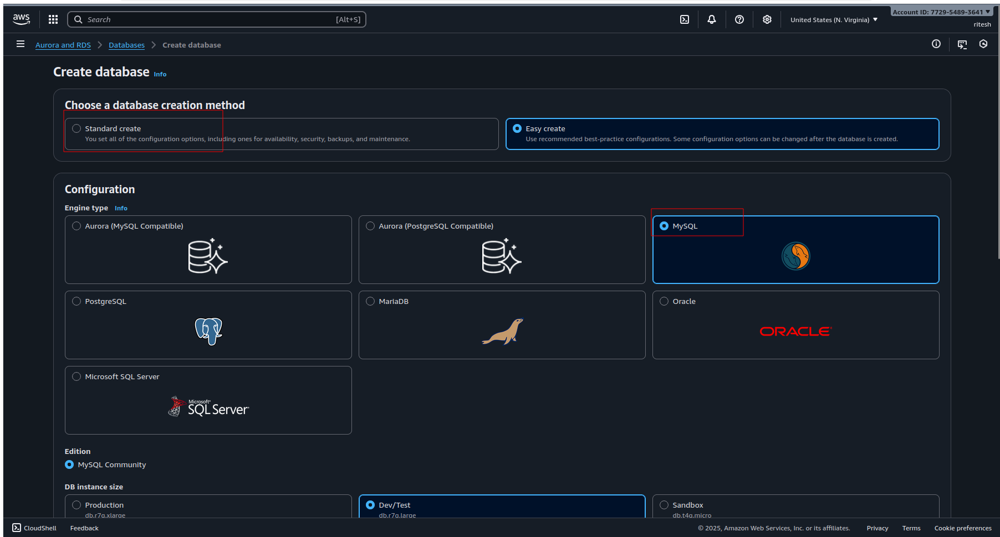
- **Version:** Latest supported version (e.g., MySQL 8.x)  

---

## ⚙️ Step 3: Choose a Template
- **Template:** Free tier (if not visible, select `Production` and use `db.t3.micro`) if in you setopu free option is avalable then go for it ..
- 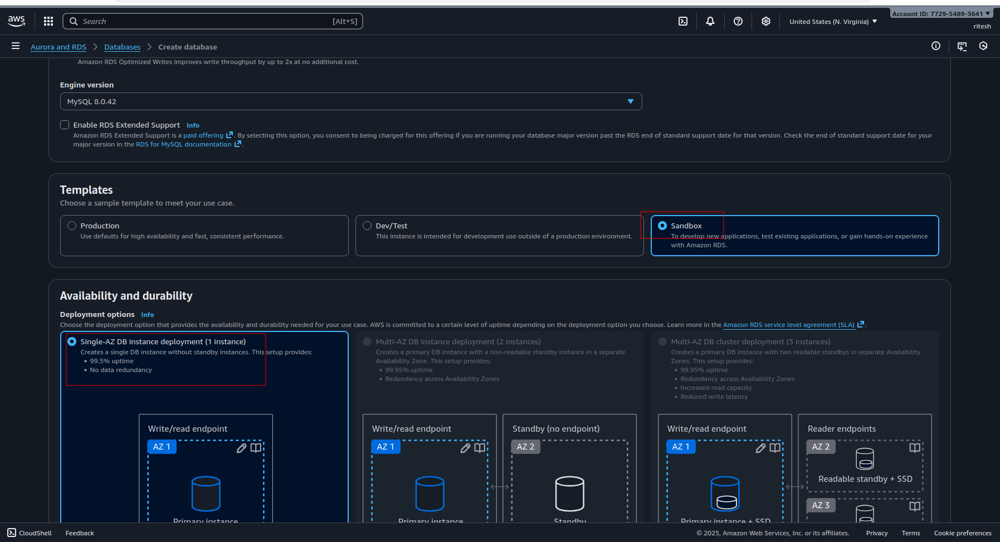  

---

## 🗝️ Step 4: Set DB Instance Details
- **DB instance identifier:** `myrds-db`  
- **Master username:** `admin`  
- **Master password:** Choose a secure password (e.g., `MyRDS@12345`)  
- Confirm password
- 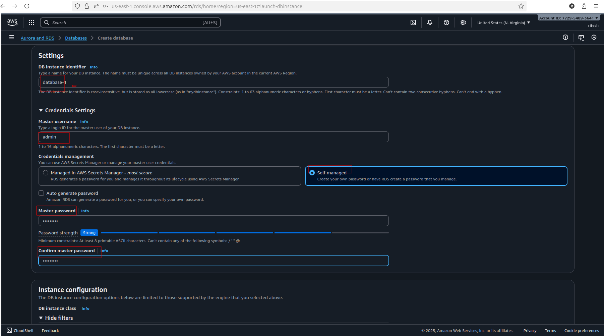

---

## 💾 Step 5: Configure Instance
- **DB instance class:** `db.t3.micro`  
- **Storage:** 20 GB (default)  
- **Storage autoscaling:** enabled (optional)
- 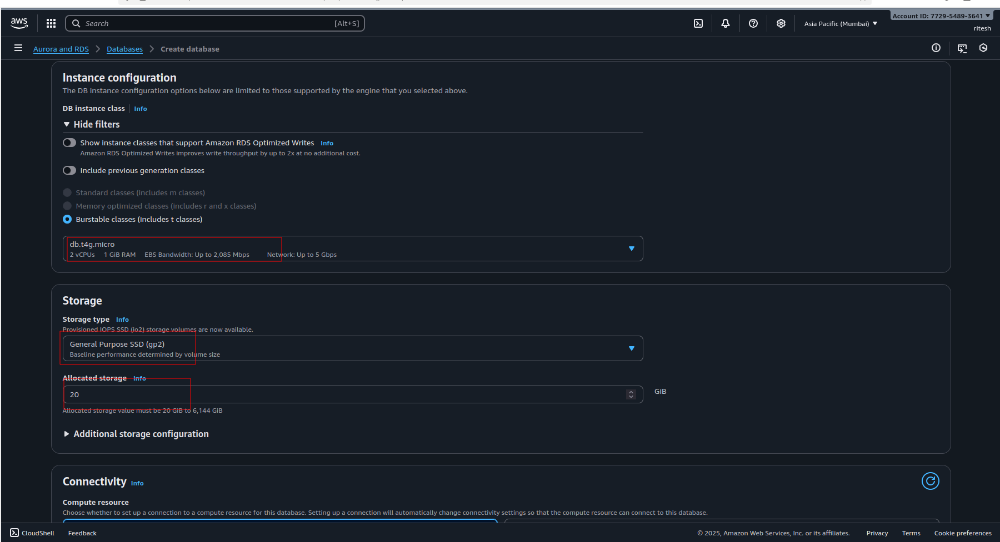

---

## 🌐 Step 6: Connectivity
1. **VPC:** default VPC  
2. **Public access:** Yes  
3. **VPC security group:** Create new → `rds-sg`
   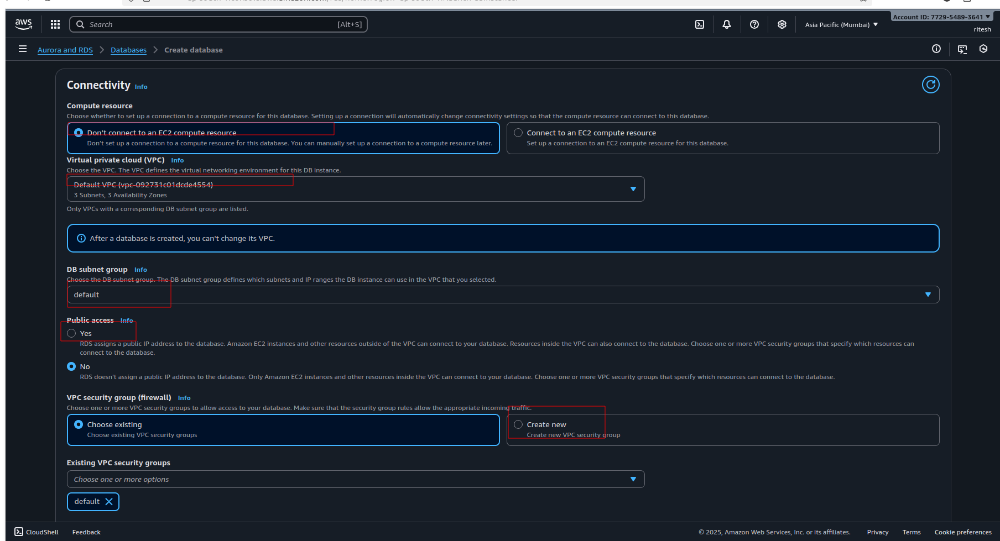
     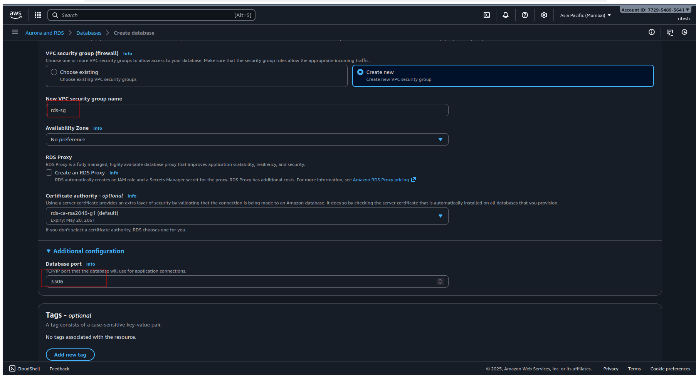


---

## 🧰 Step 7: Additional Configuration
- **Initial database name:** `devops_lab`  
- **Backup retention:** 1 day  
- **Monitoring:** optional  
- **Deletion protection:** disable  
   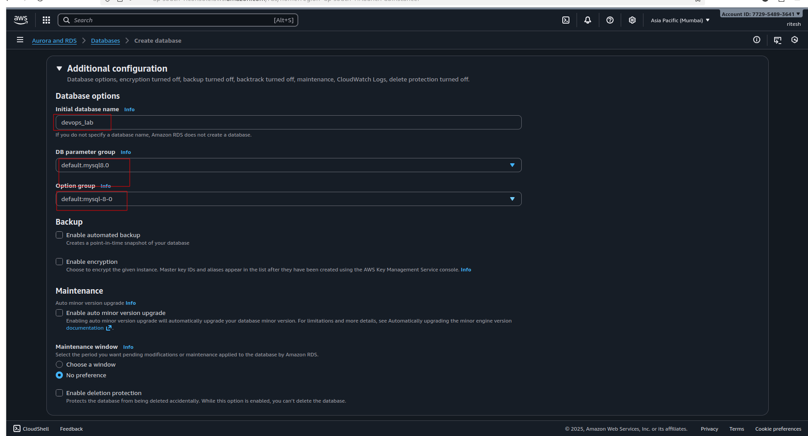

Click **Create database** 🟢  
> Wait 5–10 minutes until status shows **Available**.

---

## 🔹 Step 8: Configure Security Group Access

### 1️⃣ EC2 Security Group
- Go to **EC2 → Instances → your instance → Security → Security groups**  
- Note the EC2 security group (e.g., `ec2-sg`)  
   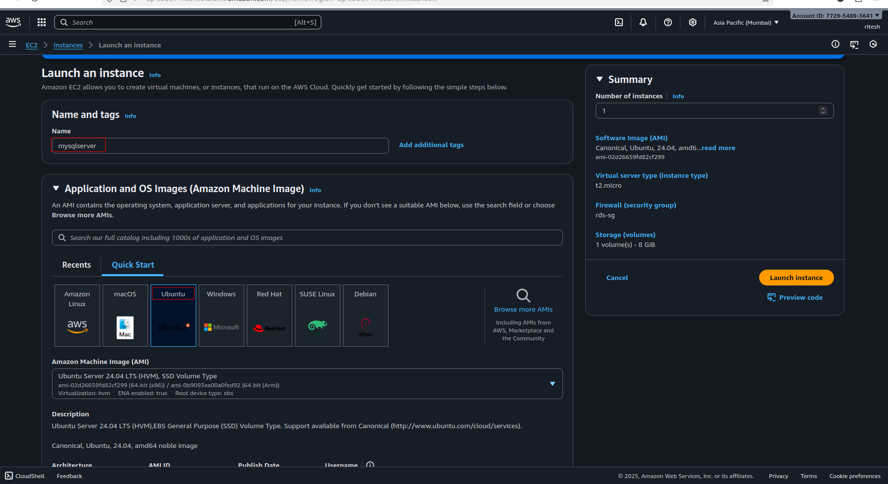

### 2️⃣ RDS Security Group
- Go to **EC2 → Security Groups → rds-sg**  
- **Inbound rules:**  
  | Type          | Protocol | Port | Source           |
  |---------------|---------|------|-----------------|
  | MySQL/Aurora  | TCP     | 3306 | EC2 security group (`ec2-sg`) |
  |SSH            | TCP     |22 | enboundrule|

> This allows the EC2 instance to connect to RDS.
   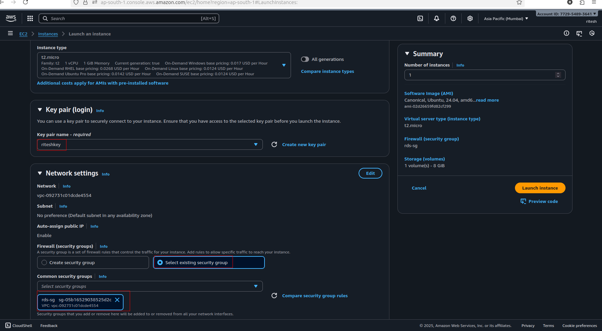


---

## 🔗 Step 9: Connect to RDS

### For Ubuntu EC2:
1. Update packages:
```bash
sudo apt update
```
2. Install MySQL client:
```bash
sudo apt install mysql-client -y
```
   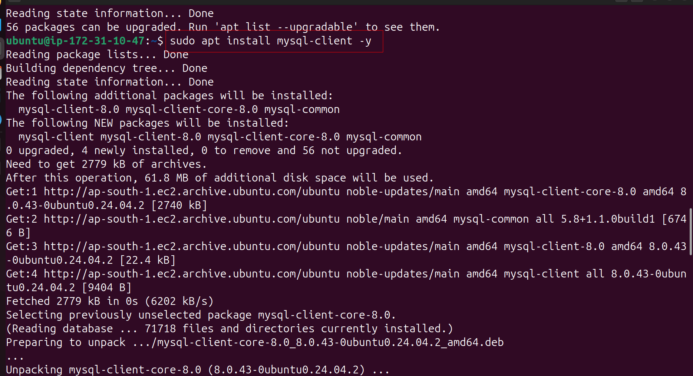


3. Connect to your RDS instance:
```bash
mysql -h <RDS-ENDPOINT> -u admin -p
```
- Replace <RDS-ENDPOINT> with your RDS endpoint
-    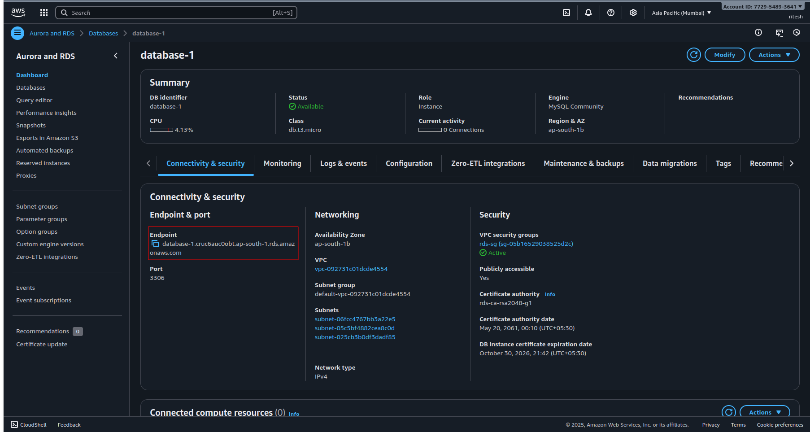

- Enter the password you created
-    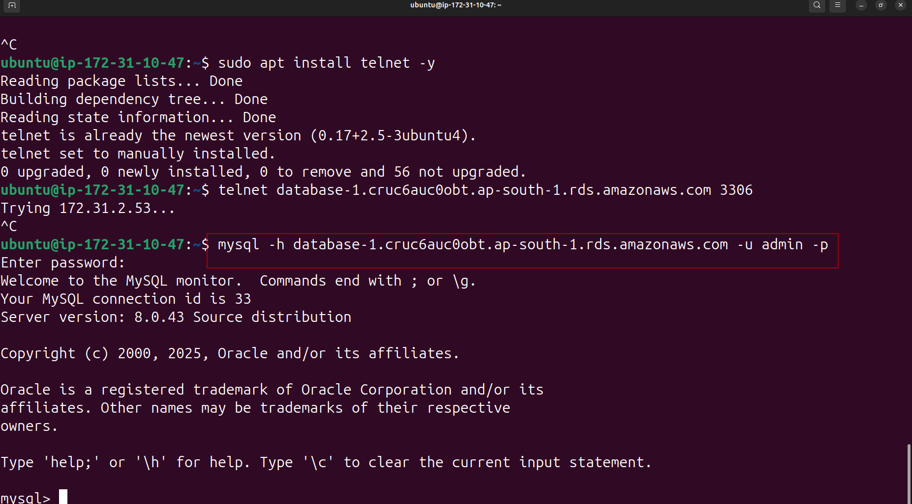


## 🧾 Step 10: Verify Database
Run SQL commands:
```bash
SHOW DATABASES;
USE devops_lab;
CREATE TABLE users (
    id INT AUTO_INCREMENT PRIMARY KEY,
    name VARCHAR(50)
);
INSERT INTO users (name) VALUES ('Ritesh'), ('DevOps');
SELECT * FROM users;
```
