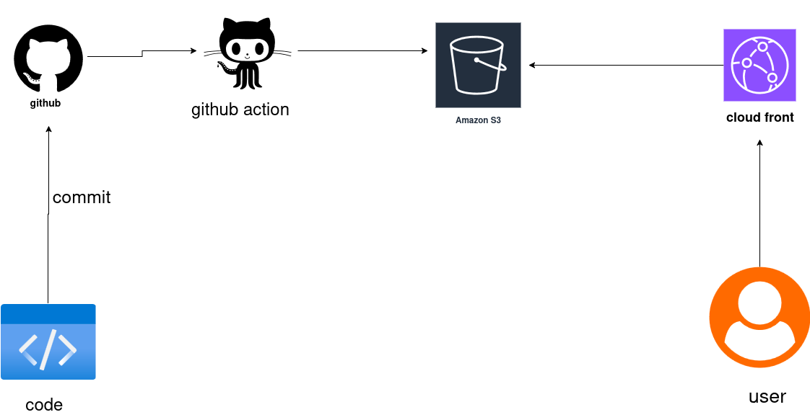
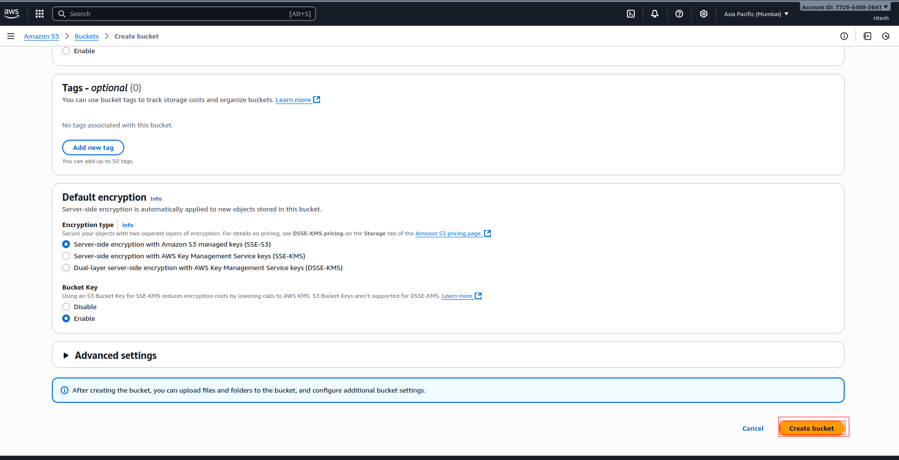
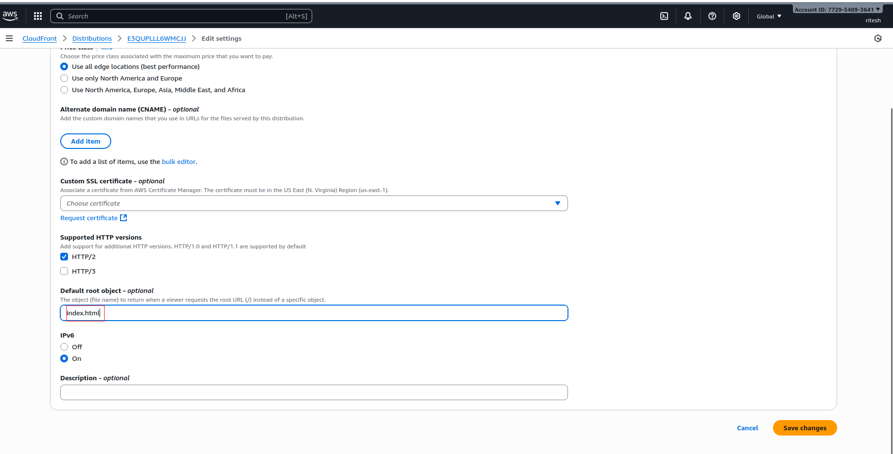
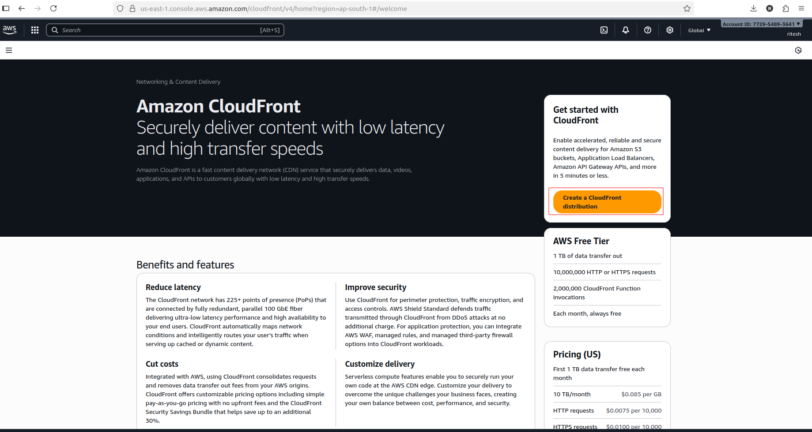
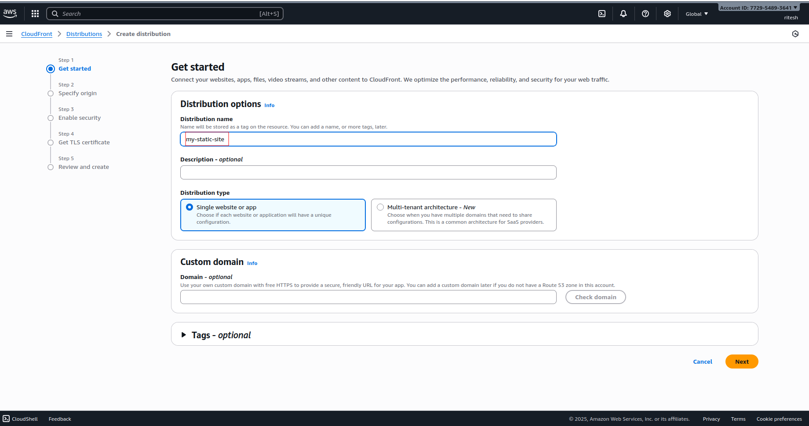
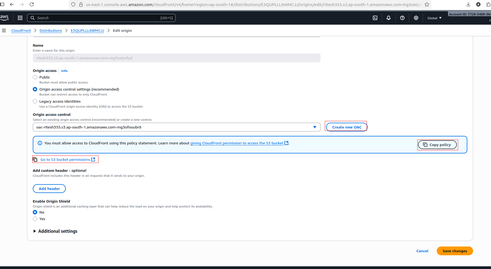
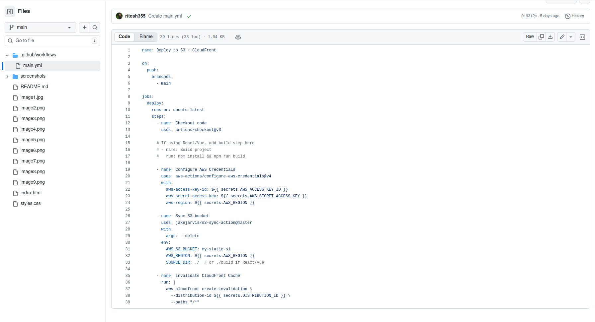
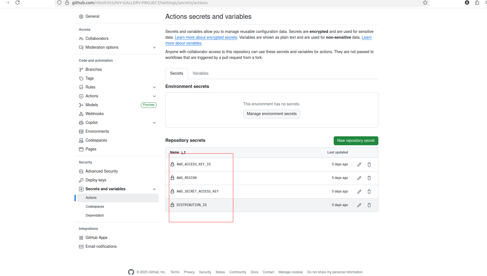

# 🌐 Static Website Hosting with AWS S3 + CloudFront + CI/CD  

### PROJECT STRUCTURE 

This project demonstrates how to host a **static website** on **Amazon S3**, deliver it globally with **CloudFront CDN**, and automate deployments using **GitHub Actions**.  

---

## 🚀 Features
- ✅ Static website hosting on **Amazon S3**  
- ✅ **CloudFront CDN** for global fast delivery + HTTPS  
- ✅ **CI/CD pipeline with GitHub Actions** (auto-deploy on push)  
- ✅ **Cache invalidation** so updates are live instantly  
- ✅ Secure **Origin Access Control (OAC)** → S3 is private, only CloudFront can access  

---

## 🏗️ Architecture Workflow

### 🔹 Request Flow

User → CloudFront (Edge Cache) → [If cache miss] → S3 Bucket → CloudFront → User

### 🔹 Deployment Flow
Developer → GitHub Repo → GitHub Actions → S3 Bucket → CloudFront → End User

---

## ⚙️ Setup Instructions

### 1️⃣ Create S3 Bucket  
- Go to **AWS S3 Console**  
- Create a bucket (region example: `ap-south-1`)  
- Keep **Block Public Access = ON**  
- Upload your static website files (`index.html`, CSS, JS, images, etc.)

---

### 2️⃣ Create CloudFront Distribution  
- Open **CloudFront Console** → Create Distribution  
- **Origin** = your S3 bucket  
- Use **Origin Access Control (OAC)** (so only CloudFront can read from S3)  
- Copy the CloudFront domain (e.g., `d1234abcd.cloudfront.net`)  

---

--- 

---

### 3️⃣ Configure GitHub Actions  

---

### 🔑 Secrets Setup in GitHub
Go to GitHub Repo → Settings → Secrets and variables → Actions → New repository secret

Add:

- AWS_ACCESS_KEY_ID

- AWS_SECRET_ACCESS_KEY
---

### 🌍 Access Your Website

Default →  (your CloudFront domain)

Optional → Add Route 53 + ACM SSL to use a custom domain 

### 📌 Future Improvements

Add CloudWatch monitoring & logging

Add Route 53 + SSL certificate for a custom domain

Extend pipeline with tests before deployment

### 🏆 Learning Outcome

By completing this project, I learned:

How to use AWS S3 for static hosting

How CloudFront works as a CDN with OAC

How to build a CI/CD pipeline with GitHub Actions

How to automate deployments and cache invalidations

---
**🔗 Keywords:** AWS, S3, CloudFront, GitHub Actions, CI/CD, DevOps, Cloud

⚡ Now, every time I push code to GitHub, my website auto-deploys to AWS with CloudFront CDN 🚀

