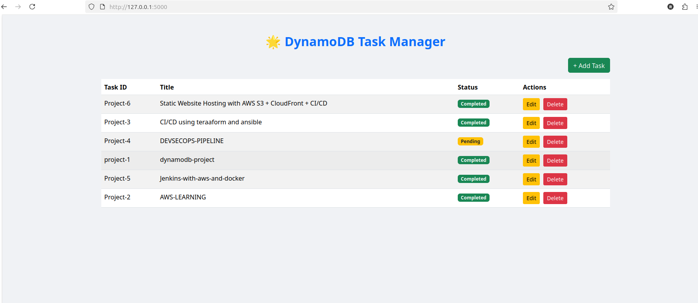
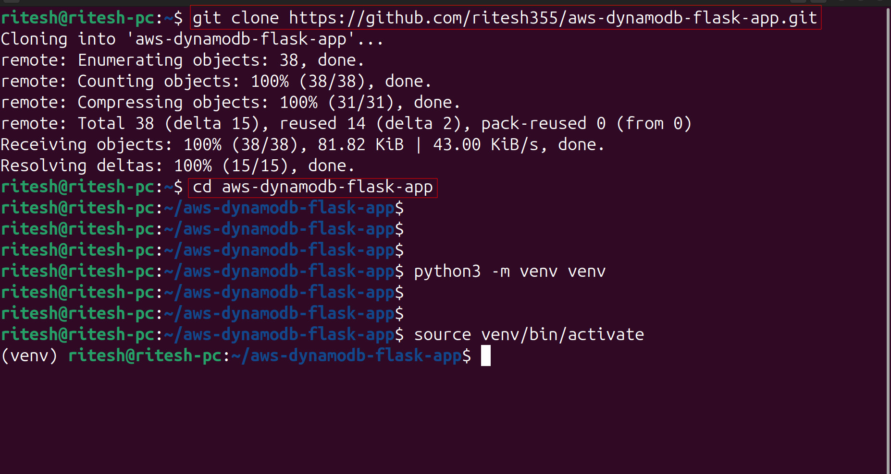
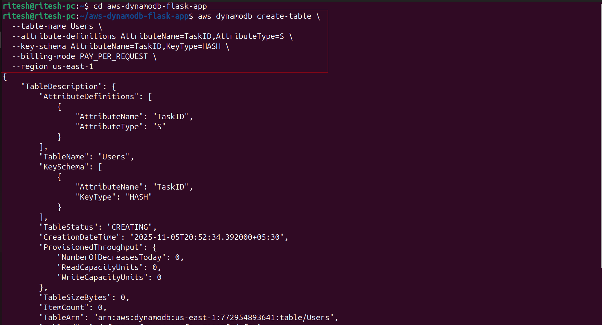
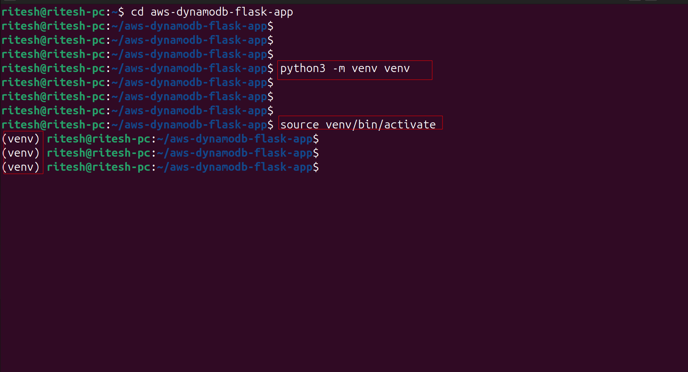
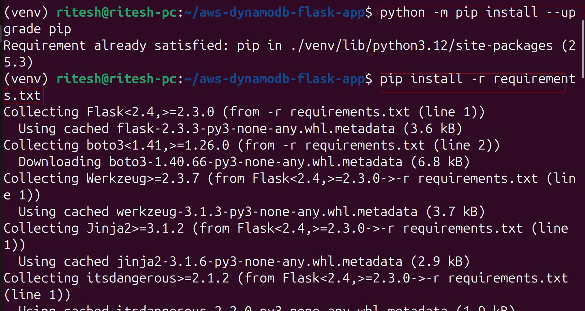
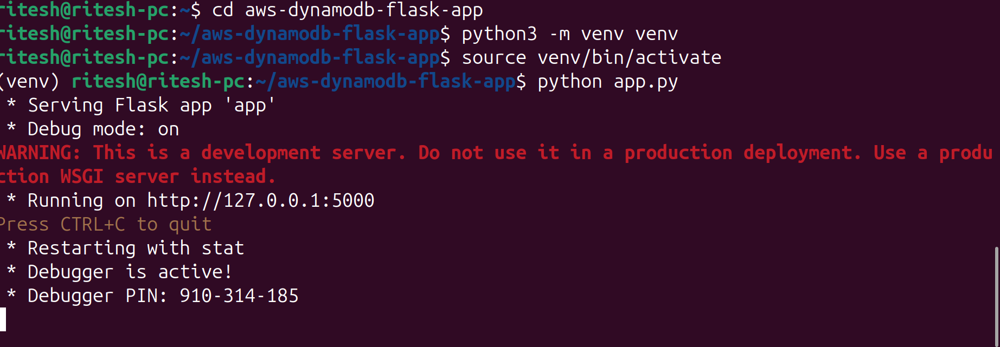
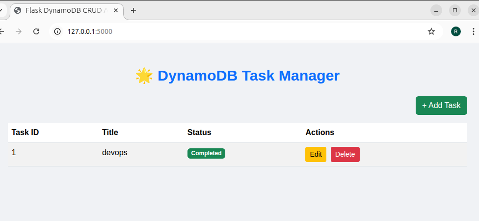

# aws-dynamodb-flask-app

A simple **Flask + AWS DynamoDB CRUD application** to manage tasks with a clean UI using Bootstrap. This app allows you to **Add, Edit, and Delete tasks** stored in a DynamoDB table.

---



---
## Project Structure

```
aws-dynamodb-flask-app/
│
├── app.py                     # Main Flask application
├── requirements.txt           # Python dependencies
├── README.md                  # Project description / instructions
│
├── templates/                 # HTML templates
│   └── index.html             # Single-page template with Add/Edit/Delete modals
│
├── static/                    # Static files (CSS, JS, images)
│   ├── style.css              # Custom CSS for styling, colors, etc.
│   └── images/                # Optional images/icons
│
├── venv/                      # Python virtual environment (ignored in git)
│
└── .gitignore                 # Ignore venv, __pycache__, etc.
```

---

## Features

* **Single-page CRUD interface** using Bootstrap modals
* **DynamoDB integration** for storing tasks
* **Add task** with unique Task ID, title, and status
* **Edit task** directly from modal
* **Delete task** with confirmation
* **Responsive design** with modern styling

---

## Setup Instructions

1. **Clone the repository**:


```bash
git clone https://github.com/ritesh355/aws-dynamodb-flask-app.git
cd aws-dynamodb-flask-app

```
2. **Configure AWS credentials** (for DynamoDB access):


```bash
aws configure
```


  - **AWS Access Key ID**: Your IAM user access key

  -  **AWS Secret Access Key:** Your IAM secret key

  -  **Default region name:** ap-south-1 (or wherever you want the table)

  - **Default output format:** json
  - Check config:
```
aws sts get-caller-identity
```
You should see your account info.

---

3.  **Create DynamoDB Table**
run this command in your terminal after aws configure


```
aws dynamodb create-table \
    --table-name Users \
    --attribute-definitions AttributeName=TaskID,AttributeType=S \
    --key-schema AttributeName=TaskID,KeyType=HASH \
    --billing-mode PAY_PER_REQUEST \
    --region ap-south-1
```


NOW tpye **ctrl+c** 
then you redirect to your terminal then type **exit** 

then again 
```
cd aws-dynamodb-flask-app
```
---

4. **Create a virtual environment**:

```bash
python3 -m venv venv
source venv/bin/activate  # Linux/macOS
venv\Scripts\activate     # Windows
```

5. **Install dependencies**:

```bash
python -m pip install --upgrade pip
pip install -r requirements.txt
```


6. **Run the Flask app**:

```bash
python app.py
```



7. **Open in browser**:

```
http://127.0.0.1:5000/
```
0r 

```
http://localhost:5000/
```
---


## DynamoDB Table Structure

* **Table Name:** `Users`
* **Primary Key:** `TaskID` (String)
* **Attributes:** `Title` (String), `Status` (String)

---

## Notes

* All modals for Add/Edit/Delete are handled in **index.html** for simplicity.
* Custom styles are in **static/style.css**.
* This project is intended for **local development**. Docker setup and CI/CD can be added later if needed.

---


---

## Author

Ritesh Singh

---

