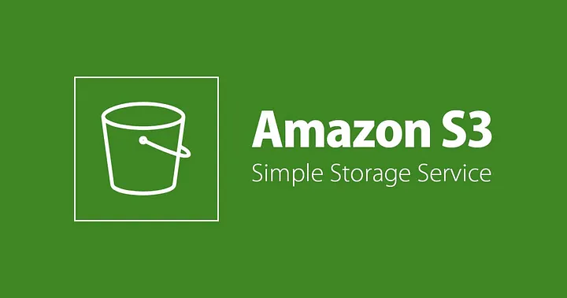
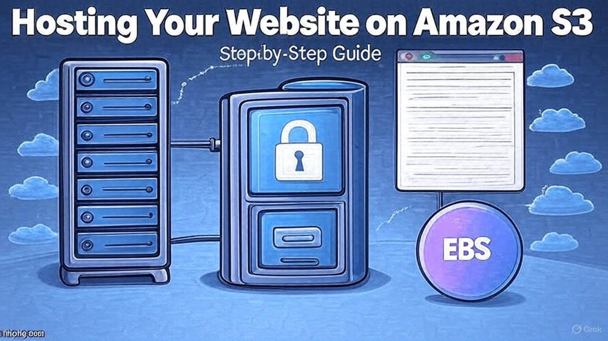
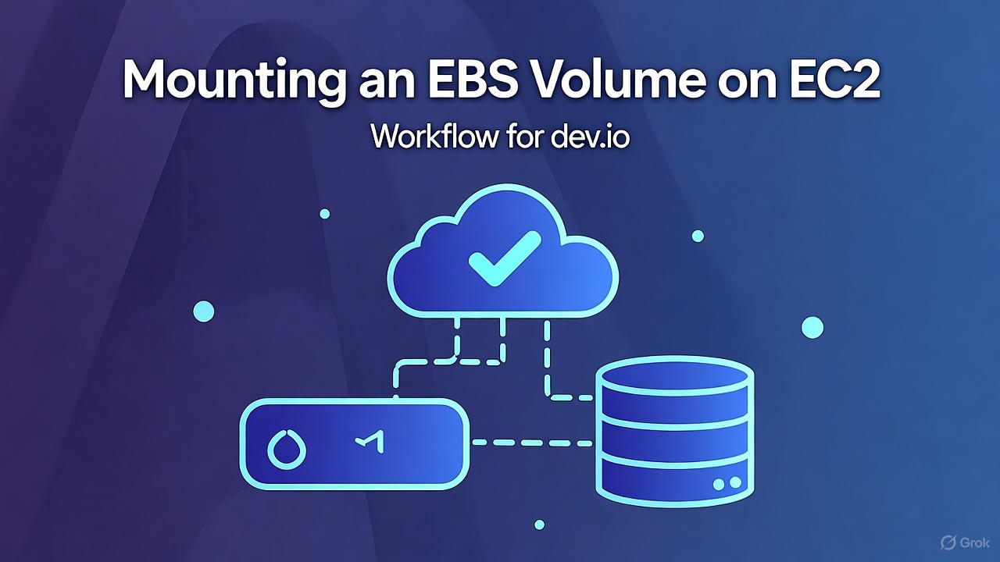
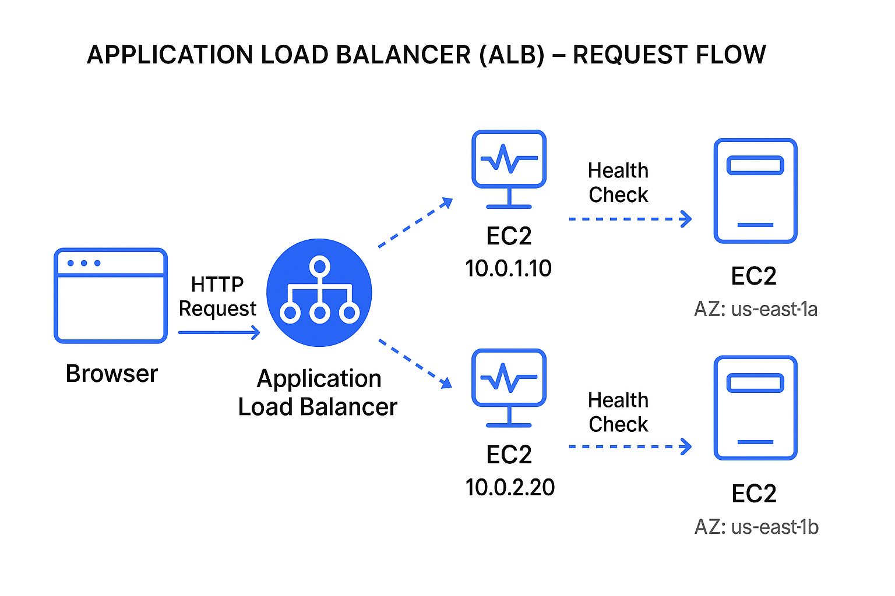
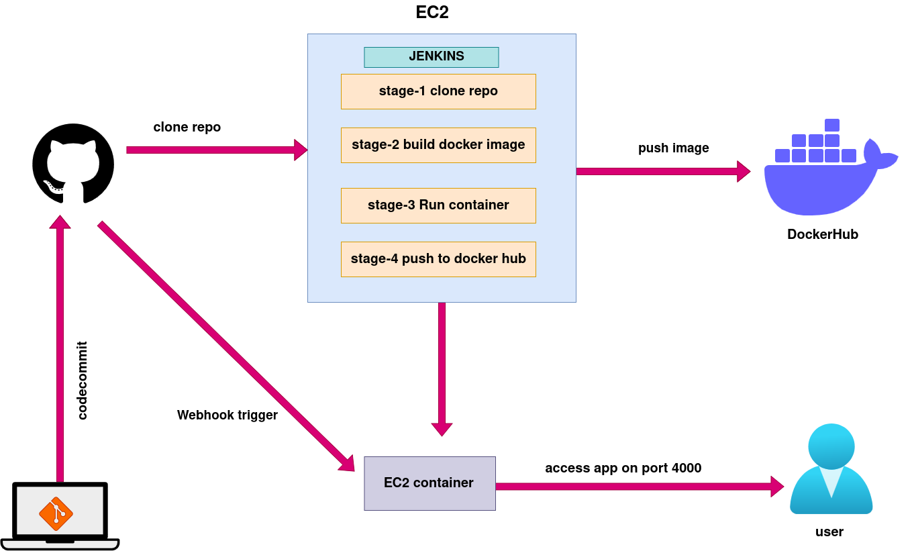
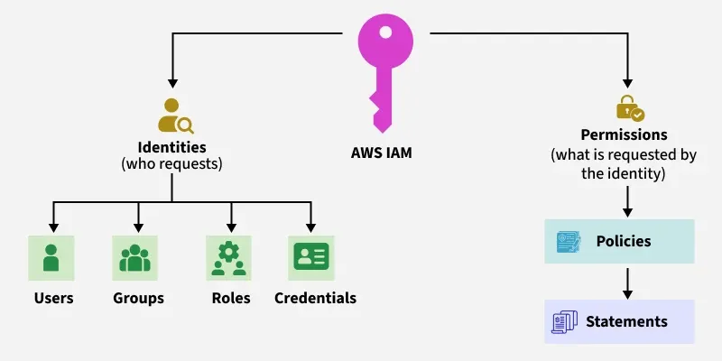
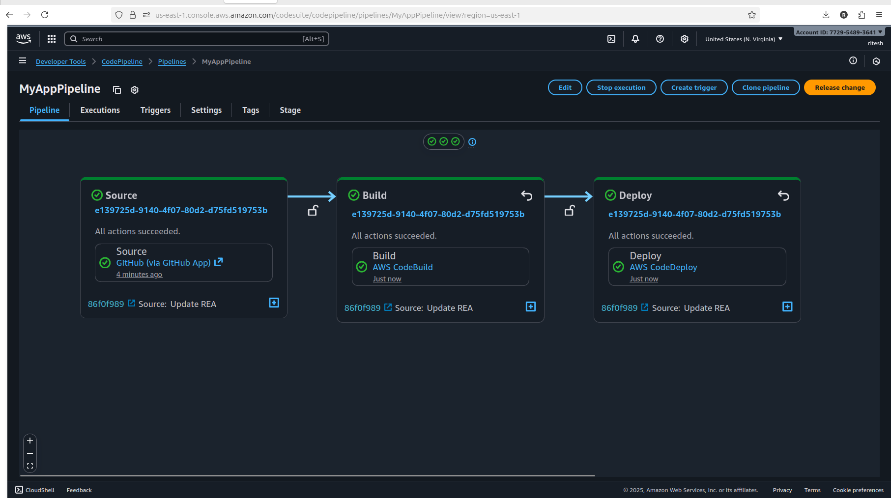
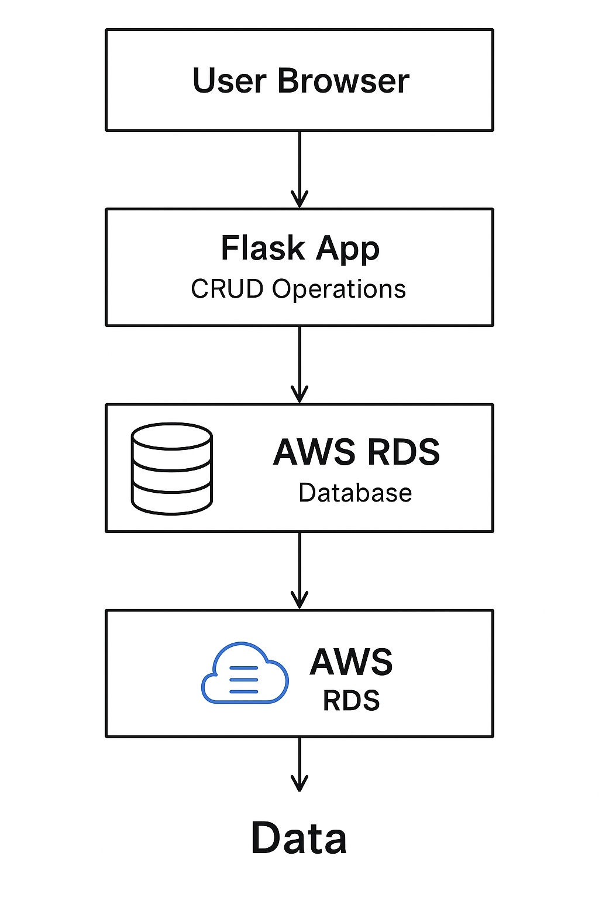
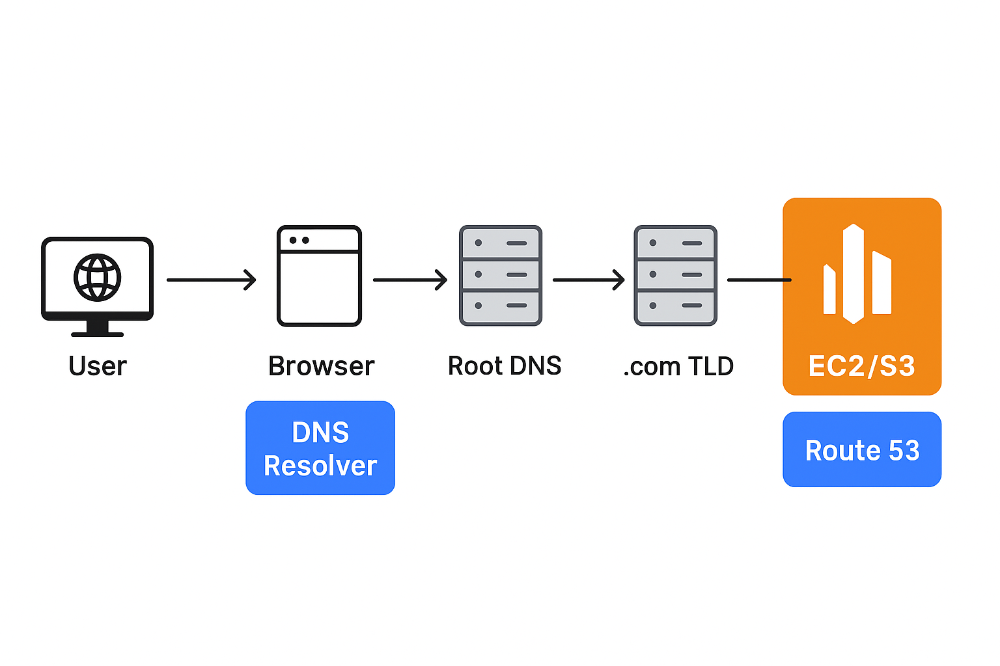

# ☁️ AWS Projects – Beginner to Advanced  

Welcome to my **AWS Projects Repository**! 🚀  
This repo is a **collection of hands-on projects** that showcase my journey of learning AWS — starting from basics like **EC2 & S3** to advanced projects with **VPC, NAT Gateways, IAM, and Automation**.  

Each project comes with:  
✅ Step-by-step guide  
✅ Screenshots for clarity  
✅ AWS best practices  
✅ Clean folder structure  

---

## 📂 Repository Structure  

---

## 📌 Projects Roadmap  

### 🔰  (Fundamentals)
1. [EC2 Instance Setup](01-ec2-instance)
   
---

2. [S3 Bucket ](02-s3-bucket)
  
---

3. [Static Website Hosting](03-Static-website-hosting)
   

   ---
4. [Mounting EBS volume](04-mounting-EBS-Volume)
   

   ---
5. [Elastic load Balancer](05-elastic-load-balancer)
    
---
6. [Docker-jenkin-app](06-deploying-application-using-jenkin)
   

---
7. [IAM](07-iam-user)
   

   ---
8. [AWS CICD with CodeBuild,CodeDeploy and AWS-Pipeline](08-cicd-with-awspipeline)
        

---
9. [AWS-RDS](09-AWS-RDS)
---
10.  [AWS-RDS-FLASK-APP](10-aws-rds-flask-project)

---
11. [static-website-hosting-using-s3-and-cloudfront](11-static-website-hosting-s3-cloudfront)

12. [aws-dynamodb-flask-app](12-aws-dynamodb-flask-app)
    

## 🎯 Learning Goals
- Gain **hands-on AWS experience**  
- Build **real-world AWS projects**  
- Prepare for **AWS Certified Cloud Practitioner** and **Solutions Architect – Associate**  

---

## 🛠️ Tech & Tools
- **AWS Console & CLI**  
- **IAM, EC2, S3, VPC, RDS, Lambda**  
- **CloudFront, ELB, Auto Scaling**  
- **CodePipeline, CodeBuild, CodeDeploy**  
- **Bash & Terraform (later for IaC)**  

---

## 📸 Screenshots
Every project folder contains an **`images/` directory** with screenshots for better understanding.  
 

---

## 🌟 Why This Repo?
- 📚 **Beginner-friendly** → Step-by-step guides  
- 💡 **Hands-on** → Real AWS console & CLI practice  
- 🏗 **Scalable** → Progressing from simple to advanced projects  
- 🎯 **Career-ready** → Helps in AWS job interviews & certifications  

---

## 🤝 Contributing
This repo is mainly for my AWS learning journey, but if you have suggestions or improvements, feel free to fork and open a PR.  

---

## 📢 Connect With Me
- 💼 [LinkedIn](https://linkedin.com/in/ritesh-singh-092b84340)  
- 📝 [Hashnode Blog](https://ritesh-devops.hashnode.dev)  
- 💻 [GitHub](https://github.com/ritesh355)  

---

⭐ If you find this repo useful, don’t forget to **star it**! ⭐  
